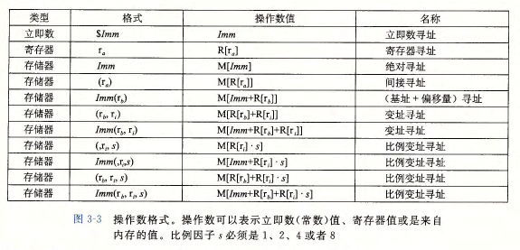

# 程序的机器级表示

[TOC]
## 1. 历史观点
因特尔处理器俗称x86,第一代芯片就是我们熟知的8086，8088是8086的一个变种，在8086上增加了一个8位的外部总线。
后面还出现了i386，i386是linux和最近版本的winddows使用的，增加了平坦寻址模式，是inter系列中唯一一台全面支持unix操作系统的机器

## 2. 程序编码
```shell
gcc -Og -o p p1.c p2.c 
```
在gcc中可以指定程序编译的优化等级，-Og使用的是符合c代码整体结构的机器代码的优化指令，我们也可以使用 1，2，3等不同的级别，通过diff编译出现的汇编文件，我们可以发现出现的汇编代码之间存在着不同，当使用过高的优化等级时，代码将出现的严重的变形（不易理解）

### 2.1 机器级代码
x86-64的机器代码和原始的C语言程序代码的差别非常大，一些通常对程序员隐藏的地方的处理器状态都是可见的：
- 程序计数器（“通常称为PC”，在x86-64中用%rip来表示）给出将要之ixng的下一条指令在内存中的地址
- 整数寄存器文件中包含16个命名的位置，分别存储64位的值，这些寄存器可以存储地址，程序的返回状态等
- 条件码寄存器保存着最佳执行的算术或逻辑指令的状态信息
- 一组向量寄存器中可以保存一个或者多个整数或浮点数值

### 2.2 代码示例
要想得到汇编代码其实只需要在进行编译的时候加入-S的参数
```latex
gcc -O1 -S 2_4.c -o 2_4_1.s
```
加入-o的参数就可以指定输出的名字，不加就会直接生成一个和原来名字相同的汇编代码

### 2.3 有关格式的注解
我们通过gcc中传入的-S参数可以实现将c语言程序转为汇编代码，但是一般情况下生成的是AMD格式，需要制定masm为intel进行
```shell
gcc -Og -S -masm=intel hello.c
```

## 3 数据格式
Intel用术语“字”(word)表示16位数据类型，32位为(double words), 64位为(quad words)


## 4. 访问信息
在63位的寄存器中都是用r开头，而在32位中都是用e开头表示的是extand
架构的不同对应着这些东西的变化，8086 -> IA32 -> x86-64

### 4.1 操作数指示符

各种不同的操作数对应的可能性被分为三种
- 立即数， 直接使用, 在ATT的模式下，用`$ + interger`,for example `$0x3f`
- 寄存器，一般用$R_a$表示寄存器a，用$R[r_a]$表示寄存器的值
- 内存引用，会根据计算出来的地址访问某个地址，类似于我们的偏移地址,用符号$M_a[Addr]$表示对存储在内存中从地址ADDr开始的b个字节值的引用


|operation|value|comment|
|-|-|-|
|%rax|0x100|register|
|0x104|171|absolute address|
|$0x108|0x108|immediate value|
|{%rax}|0xFF|storage|
|4{%rax}|0xAB|address 0x10|
|9{%rax,%rdx}|0x11|address 0x10c|
|260{%rcx,%rdx}|0x13|0x108|
|0xFC{,%rcx,4}|0xFF|0x100|
|{%rax,%rdx,%4}|0x11|0x10c|

### 4.2 数据传送指令
|指令|效果|描述|
|-|-|-|
|movb||传送字节|
|movw||传送字|
|movl||传送双字|
|movq||传送四字|
|movabsq|I$\to$R|传送绝对的四字|


MOVZ类中的指令把目的中剩余的字节填充为0，MOVS类指令通过符号拓展进行填充，把元操作的最高位进行复制

### 4.3 数据传送
间接引用指针其实就是将指针放在一个寄存器中，然后进行交换。
需要注意的是像一些局部变量其实是会被放在寄存器中的。

### 4.4 压入和弹出栈数据
使用push将数据压入到栈中，使用pop将数据弹出
要注意的是在这个过程中要遵循先进先出的原则。
将一个数据压入到栈中时，需要将栈的指针减8，然后读如数据
> 因为在x86-64中数据是小端存放的，所以是减8

## 5 算术和逻辑操作
指令类ADD由四条加法指令组成
|command|usage|
|-|-|
|addb|字节加法|
|addw|字加法|
|addl|双字加法|
|addq|四字加法|


### 5.1 加载有效地址
当你使用反汇编去调试C语言的程序时，你会发现我们的程序调用了rbp这个栈帧指针，但是当你使用优化进行编译的时候，这个栈帧数指针可能会消失。
未开启的时候如下面所示
```nasm
 movq    %rdi, -24(%rbp)
    movq    %rsi, -32(%rbp)
    movq    %rdx, -40(%rbp)
    movq    -32(%rbp), %rax
    leaq    0(,%rax,4), %rdx
    movq    -24(%rbp), %rax
    leaq    (%rdx,%rax), %rcx
    movq    -40(%rbp), %rdx
    movq    %rdx, %rax
    addq    %rax, %rax
    addq    %rdx, %rax
    salq    $2, %rax
    addq    %rcx, %rax
    movq    %rax, -8(%rbp)
    movq    -8(%rbp), %rax
    popq    %rbp
```
开启的时候如下所示
```nasm
leaq    (%rdi,%rsi,4), %rax
leaq    (%rdx,%rdx,2), %rdx
leaq    (%rax,%rdx,4), %rax
```
So， csapp using the O2

You can find more in the [gcc](../basic/wiki/gcc.md)

### 5.2 一元和二元操作

The operation like the INC... is the unary operations. the operation like the mov is the binary operation

### 5.3 The shfit operation
I think it is simple...
## 6 control

### 6.1 The condition code 
CF: The carry flag 
ZF: Zero flag 
SF: Sign flag, it can make the negative number
OF: Overflow flag, it means the number is overflow, like two negative numbers or
two positive numbers.

We always use the flag to set the contion 

### 6.2 visit the condition code

## 10. Combining Control and Data in Machine-Level Programs
### 10.1 understanding pointers 
Just like c

### 10.2 using GDB 


### 10.3 Out-of-Bounds Memory Reference and Buffer Overflow

That's the reason why the gcc advice you to use the fgets instead of the gets.
Take the function echo for example
```c
void echo()
{
char buf[8]; /* Way too small! */
gets(buf);
puts(buf);
}
```
对它进行反汇编之后可以发现其实知识将栈帧指针减去了一定的数目，相当于分配了八个字节的空间，但是一旦超过之后就会发生越界。

Except from the gets, the library function like the strcpy... also has such problem.


### 10.4 Some ways to defend the attack
1. Random stack
简单来说，就是每次进行程序的运行，存放的数据的位置都是不同的，一次来对抗对计算机的攻击

2. test the broken stack
就是在我们的栈中分配一个金丝雀值， 如果我们的栈发生了溢出，由于这个存放的位置是在栈的下方，所以当数据发生溢出的时候，该处的数据将会被修改，当进行xor后，发现此时的数值发生了改变，那么此时就说明发生了栈溢出

3. restrict the area of excultable area
Only the place where reserved by the translater can have the execute permission.

### 10.5 support the variable length stack frame
Using the rbp as the frame pointer(base pointer). 

